<div align="center">

# Multi-Task Calculator

**Every calculator you actually need, in one fast offline app.**

[](https://flutter.dev)
[](https://dart.dev)
[](https://flutter.dev)
[](LICENSE)

A calculator app with 16 purpose-built calculators, 17 unit-conversion
categories, and a number base converter — all working completely offline, with
no account and no data collection.

</div>

---

## Screenshots

| Home | General Calculator | Scientific |
| :---: | :---: | :---: |
| 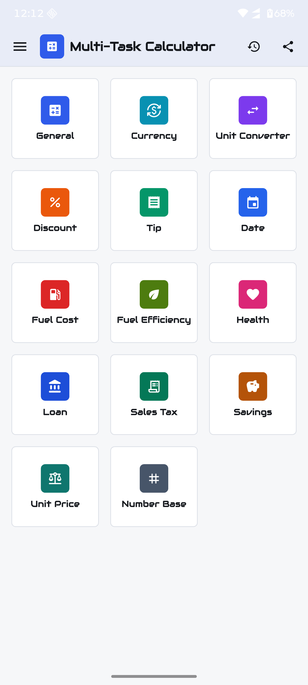 | 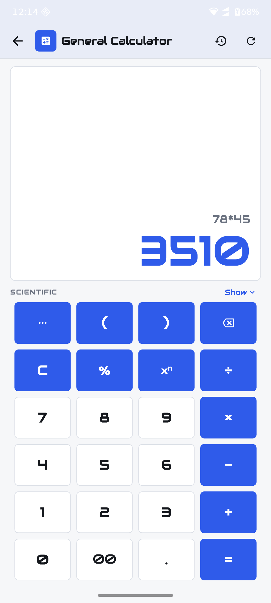 | 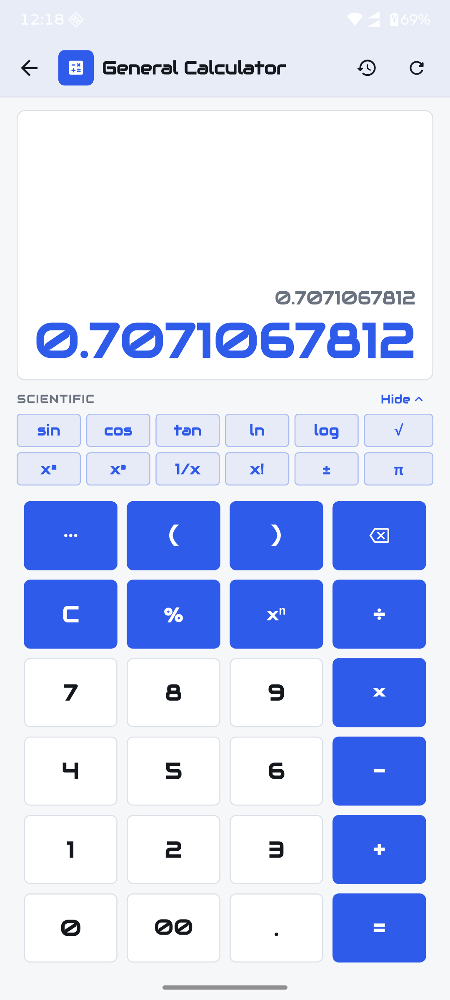 |
| **History** | **Currency Converter** | **Unit Converter** |
| 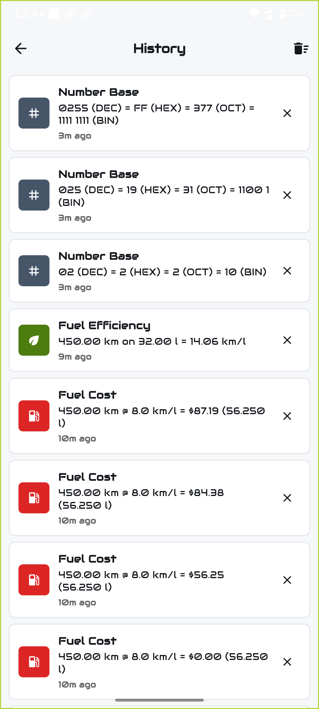 | 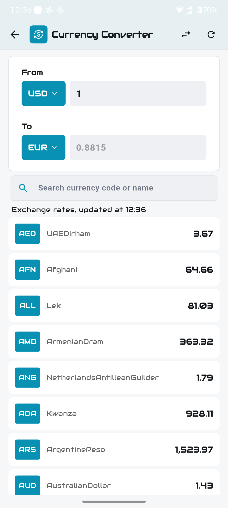 | 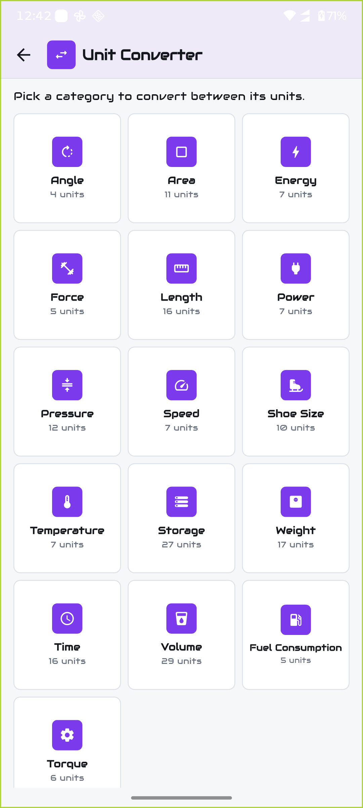 |
| **Length converter** | **Number Base** | **Tip Calculator** |
| 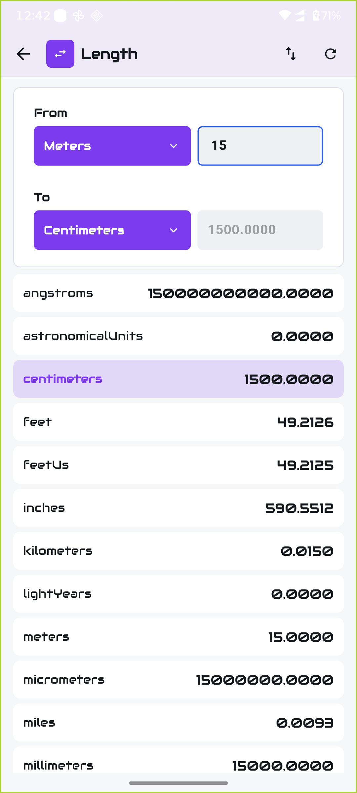 | 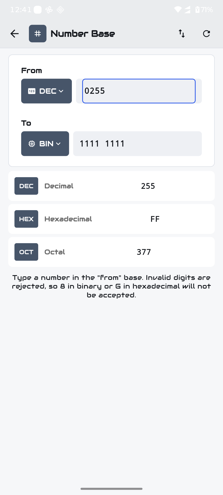 | 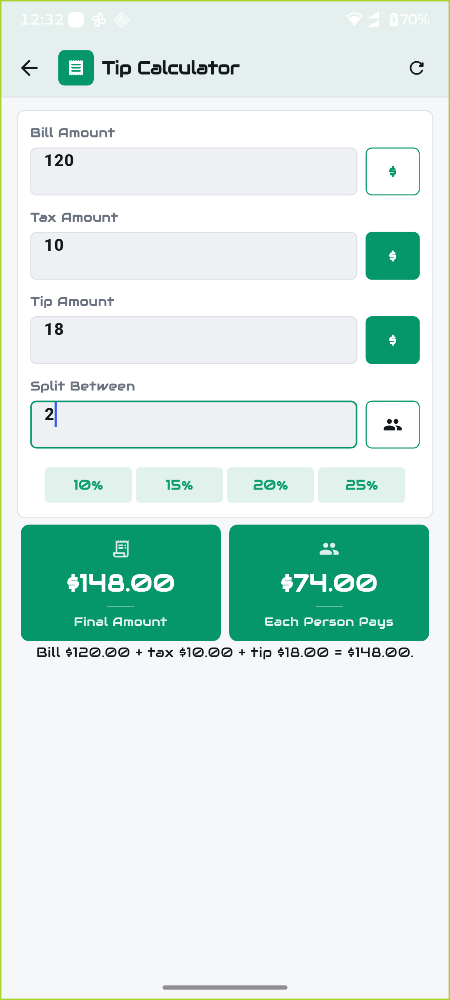 |
| **Discount** | **Sales Tax** | **Loan** |
| 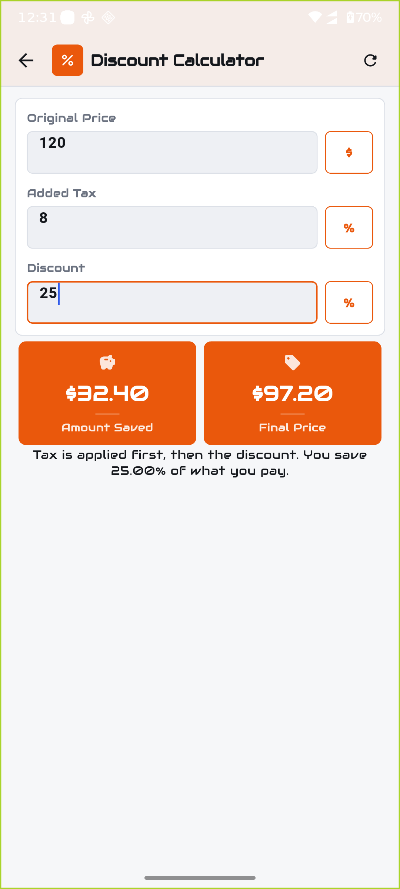 | 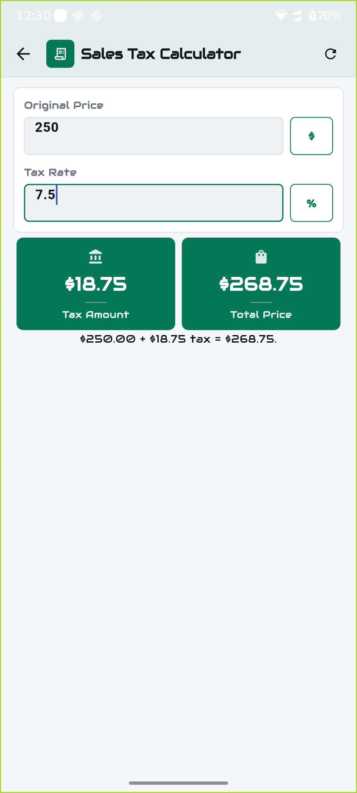 | 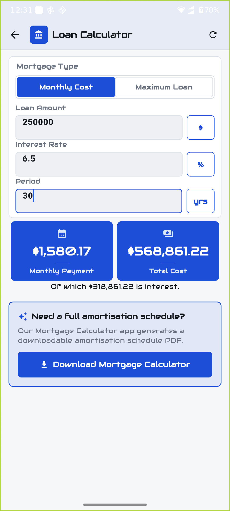 |
| **Savings** | **Health** | **Fuel Cost** |
| 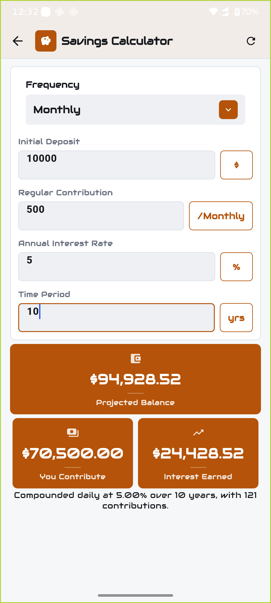 | 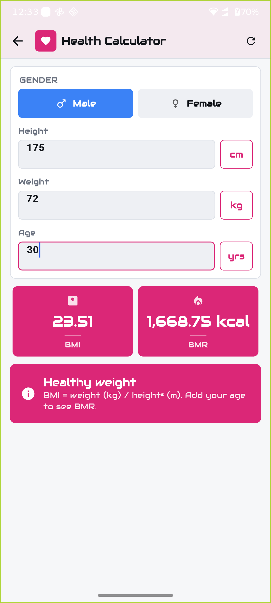 | 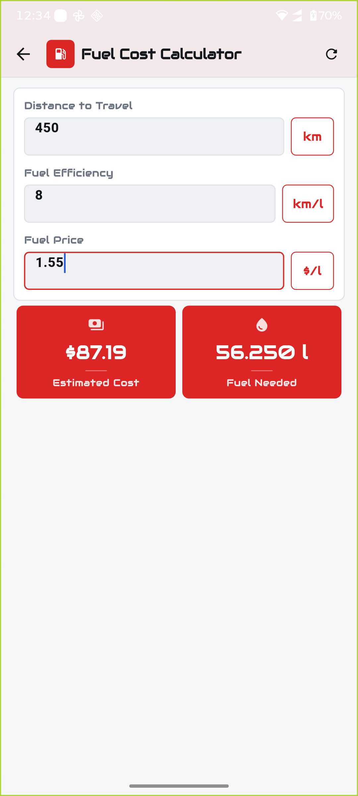 |
| **Fuel Efficiency** | **Date Calculator** | **Unit Price** |
| 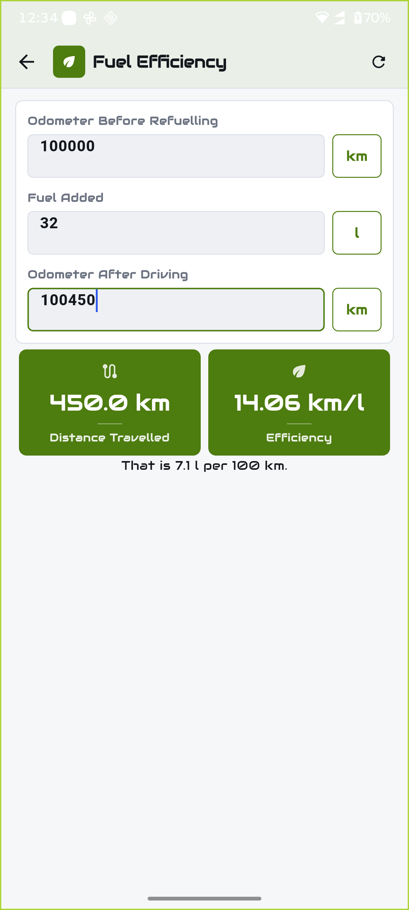 | 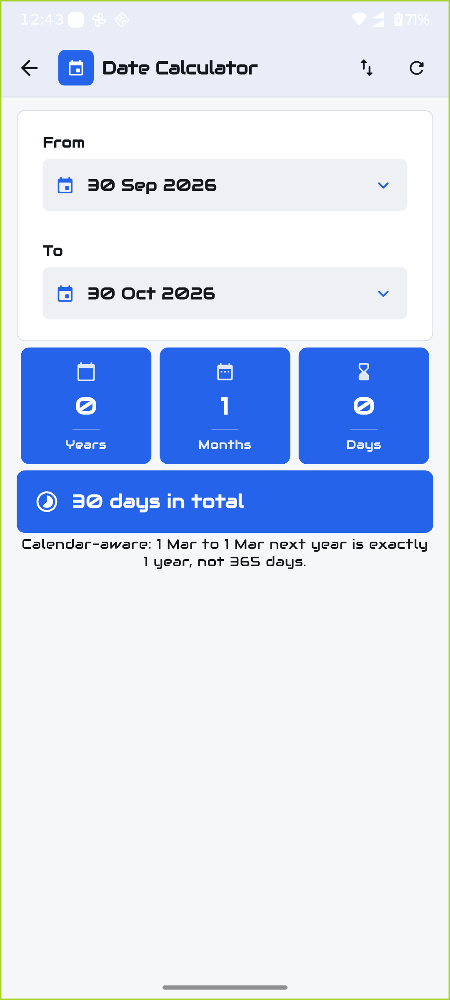 | 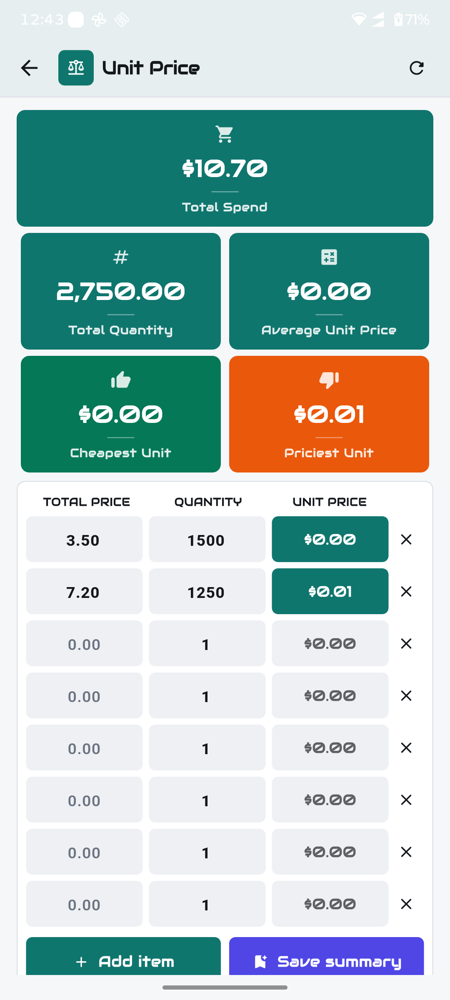 |

<div align="center">

**Loan · Maximum** &nbsp;·&nbsp; **Dark mode** &nbsp;·&nbsp; **Navigation drawer** &nbsp;·&nbsp; **Help & FAQ**

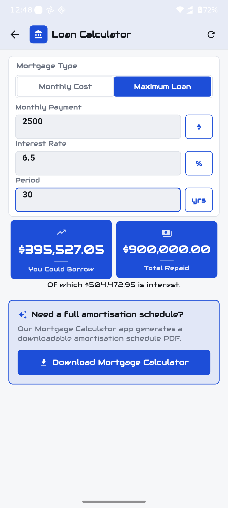
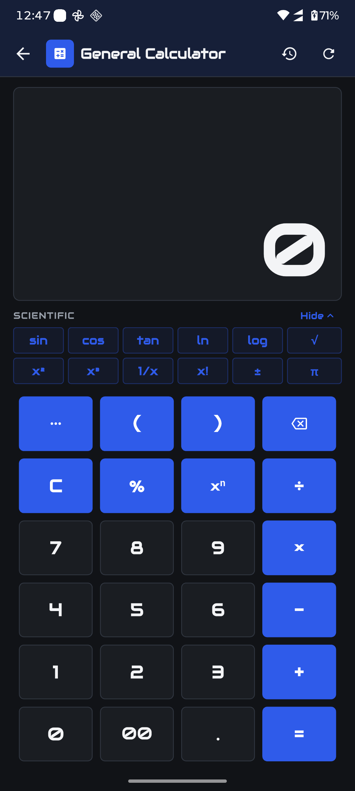
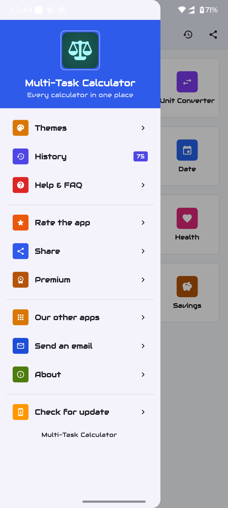
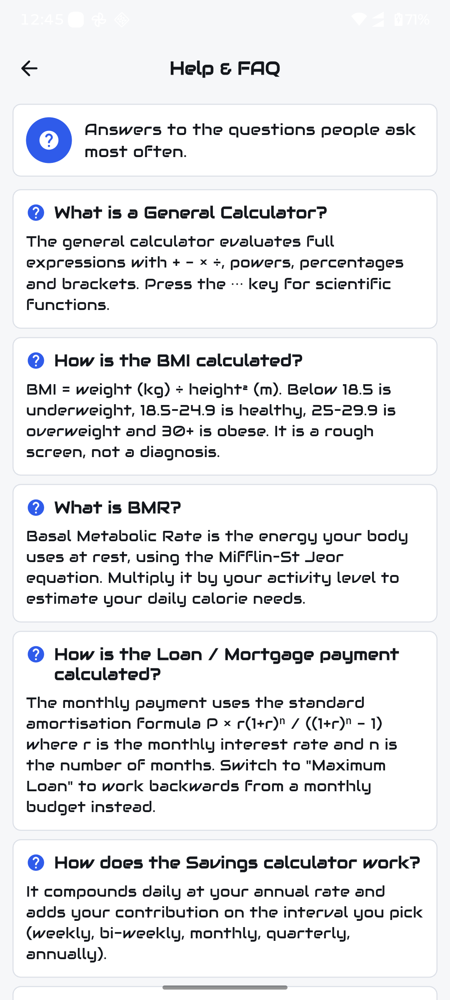

</div>

---

## Features

### Calculators

| Calculator | What it does |
| --- | --- |
| **General** | Full expressions with `+ − × ÷`, powers, brackets, percentages and 12 scientific functions (`sin`, `cos`, `tan`, `ln`, `log`, `√`, `x²`, `x³`, `1/x`, `x!`, `±`, `π`). Live preview as you type. |
| **Tip** | Bill + tax + tip, split evenly between any number of people. Tap the `$` / `%` chip to switch either input between an amount and a percentage. One-tap 10 / 15 / 20 / 25 % presets. |
| **Discount** | Applies tax first, then the discount, and shows exactly how much you saved. |
| **Sales Tax** | Tax amount and tax-inclusive total. |
| **Loan / Mortgage** | Standard amortisation. *Monthly Cost* mode: given a loan, get the monthly payment and total cost. *Maximum Loan* mode: given a monthly budget, get how much you can borrow. Handles 0 % interest correctly. |
| **Savings** | Compounds daily and adds a contribution weekly, bi-weekly, monthly, quarterly or annually. Reports the projected balance, what you contribute and the interest earned. |
| **Health** | BMI with the full WHO category range, and BMR via the Mifflin–St Jeor equation. Gender-aware. |
| **Fuel Cost** | Trip cost and litres required from distance, efficiency and fuel price. |
| **Fuel Efficiency** | Actual km/l from two odometer readings and the amount of fuel used, plus l/100 km. |
| **Date** | Calendar-aware years / months / days between two dates, plus the total day count. Swappable. |
| **Unit Price** | Compare products by their true unit price. Adds up total spend, total quantity, average, cheapest and priciest unit price. |
| **Currency** | Live exchange rates for ~160 currencies, with search and a one-tap swap. |
| **Number Base** | Decimal, hexadecimal, octal and binary, with invalid digits rejected. |
| **Unit Converter** | 17 categories — angle, area, energy, force, length, power, pressure, speed, shoe size, temperature, storage, weight, time, volume, fuel consumption and torque. |

### Everything else

- **100 % offline.** No account, no sign-in, nothing leaves your phone.
- **Calculation history.** Every result is saved automatically and browsable,
  deletable per entry or clearable in one go.
- **Light, dark and system themes**, with text scaling clamped so the dense
  layouts stay readable.
- **No `Infinity` results.** Degenerate input (dividing by an empty field)
  shows a safe `0.00` instead.
- **Help & FAQ** answering the questions people actually ask.

---

## Tech stack

| Layer | Choice |
| --- | --- |
| Framework | Flutter 3.44 / Dart 3.12 |
| State | `provider` (`ChangeNotifier`) |
| Persistence | `shared_preferences` |
| Build | Gradle Kotlin DSL (AGP 9.0.1, Gradle 9.1, Kotlin 2.3.20) |
| Ads | **None.** Completely ad-free, no ad SDK in the dependency tree |
| Networking | `dio` |
| Calculation | `function_tree`, `units_converter` |
| Tests | `flutter_test` + `flutter_lints` |

### Project layout

```
lib/
├── components/          # Shared widgets (scaffold, result cards, inputs)
├── pages/               # One directory per calculator
│   └── <tool>/
│       ├── components/  # Tool-specific widgets
│       └── model/       # Data models
├── services/            # Ads, API, history, preferences, version check
├── utils/               # Theme, colours, routing, pure calculation helpers
└── main.dart
```

The calculation logic lives in **`lib/utils/calculator_math.dart`**, which has
no Flutter dependency and is fully unit tested.

---

## Getting started

### Prerequisites

- Flutter 3.27 or newer (`flutter --version`)
- Android Studio / Android SDK for Android builds
- Xcode for iOS builds

### Run it

```bash
git clone https://github.com/imamhossain94/multi-task-calculator.git
cd multi-task-calculator
flutter pub get
flutter run
```

### Build a release

```bash
flutter build appbundle --release   # Android, for Play Store
flutter build apk --release         # Android APK
flutter build ipa --release         # iOS
```

> The Gradle build uses the **Kotlin DSL** (`build.gradle.kts`). If you are
> migrating from the old Groovy scripts, the equivalents are in
> `android/build.gradle.kts` and `android/app/build.gradle.kts`.

---

## Release signing

Signing material is **never** committed. The build reads it from
`android/key.properties`, which is git-ignored:

```properties
# android/key.properties  (create this locally, do not commit)
storeFile=/absolute/path/to/your-upload-keystore.jks
storePassword=your-store-password
keyAlias=upload
keyPassword=your-key-password
```

With that file present, `flutter build appbundle --release` signs with the
release key. Without it, release builds fall back to debug signing so
`flutter run --release` still works locally.

See the [Android signing guide](https://docs.flutter.dev/deployment/android#signing-the-app).

---

## Update checks

The app checks a small JSON manifest for new versions instead of talking to a
backend you have to run. Point it at any HTTPS URL:

```json
{
  "version": "1.3.0",
  "forceUpdate": false,
  "notes": "Bug fixes and a new currency"
}
```

Override at build time:

```bash
flutter build appbundle --release \
  --dart-define=UPDATE_MANIFEST_URL=https://example.com/version.json
```

`forceUpdate: true` shows a blocking dialog. The default manifest URL points
at `version.json` in this repository.

---

## No ads, no tracking

There is no ad SDK in the dependency tree at all — not AdMob, not anything
else. No banner, no interstitial, no analytics, no identifiers. The
"Support" page in the drawer is a thank-you and a link to leave a review, not
a paywall.

---

## Security and privacy

This repository is public, and the following are deliberately **excluded**:

- `key-store/`, `*.jks`, `*.keystore`, `*.p12`, `*.pem`, `key.properties`
- `android/app/google-services.json` and `ios/Runner/GoogleService-Info.plist`
- `local.properties`, `*.env*`
- Build output (`build/`, `android/app/release/`, `*.aab`, `*.apk`)

These paths were also purged from the Git history, so they are not recoverable
from old commits.

The app collects nothing, has no analytics, and makes no network request
unless you open the currency converter (exchange rates) or the update screen.

---

## Testing

```bash
flutter analyze   # static analysis, must be clean
flutter test      # unit + widget tests
```

The test suite covers the pure calculation layer — including the specific bugs
that were fixed (0 % interest loans, the savings first-contribution bug, the
self-contradicting date breakdown, BMI categories, and every division-by-zero
path) plus a smoke test that the app boots to the home screen.

---

## Contributing

Issues and pull requests are welcome. If you are adding a calculator:

1. Put the maths in `lib/utils/calculator_math.dart` with tests.
2. Guard every division — use `NumX.divide`, never raw `/`.
3. Pick a `ToolPalette` in `app_color.dart` so the screen gets its accent colour.
4. Use `CalculatorScaffold` so the layout stays consistent.
5. Run `flutter analyze` and `flutter test` before opening a PR.

---

## License

MIT — see [LICENSE](LICENSE).

**Made by [Md. Imam Hossain](https://github.com/imamhossain94).**
